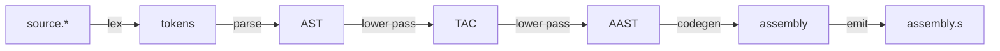

# cyan

[](https://github.com/norskeld/cyan/actions/workflows/checks.yml)

Compiler for a subset of C.

## Flowchart

Compiler flowchart:



## Grammar

```ebnf
<program>    ::= <function>
<function>   ::= "int" <identifier> "(" "void" ")" "{" <statement> "}"
<statement>  ::= "return" <expression> ";"
<expression> ::= <int> | <unary-op> <expression> | "(" <expression> ")"
<unary-op>   ::= "-" | "~"

<identifier> ::= ? An identifier token ?
<int>        ::= ? A constant token ?
```

## Trees

> [!NOTE]
> AST, TAC and AAST are described using [Zephyr ASDL][zephyr].

### AST

This is a syntactic tree representation of the C program.

```zephyr
program = Program(function)

function =
  | Function(identifier name, statement body)

statement =
  | Return(expression)

expression =
  | Constant(int)
  | Unary(unary_op, expression)

unary_op =
  | BitwiseNot
  | Negate
```

### Three Address Code (TAC)

This IR lets us handle structural transformations — like removing nested expressions — separately from the details of assembly language, and it's also well suited for applying some compile-time optimizations.

```zephyr
program = Program(function)

function =
  | Function(identifier, instruction* body)

instruction =
  | Return(value)
  | Unary(unary_op, value src, value dst)

value =
  | Constant(int)
  | Var(identifier)

unary_op =
  | BitwiseNot
  | Negate
```

### Assembly AST (AAST)

This IR is used to emit assembly code.

```zephyr
program = Program(function)

function =
  | Function(identifier name, instruction* instructions)

instruction =
  | Mov(operand src, operand dst)
  | Unary(unary_op, operand)
  | AllocateStack(int)
  | Ret

unary_op =
  | Neg
  | Not

operand =
  | Imm(int)
  | Reg(reg)
  | Pseudo(identifier)
  | Stack(int)
```

## Links

- [C23 standard (working draft)](https://open-std.org/JTC1/SC22/WG14/www/docs/n3220.pdf)
- [x86-64 instruction set](https://www.felixcloutier.com/x86/)
- [x86 assembly](https://en.wikibooks.org/wiki/X86_Assembly)
- [System V ABI](https://gitlab.com/x86-psABIs/x86-64-ABI)
- [Zephyr ASDL][zephyr]

## License

[MIT](LICENSE).

<!-- Links. -->

[zephyr]: https://www.cs.princeton.edu/~appel/papers/asdl97.pdf
